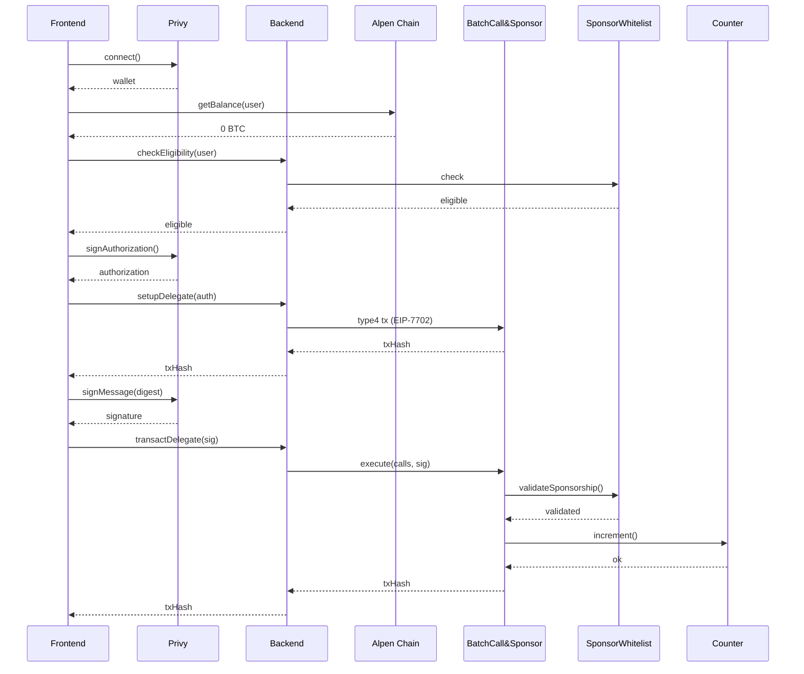

# BTC Gas Sponsorship on Alpen

## Architecture & Technical Design

This document explains the architecture, technical decisions, security
considerations, and how to adapt this demo for your own implementation.

The goal of this project is to demonstrate **gas sponsorship on Alpen**,
where the native gas token is BTC, allowing users with **0 BTC balance**
to execute transactions.

------------------------------------------------------------------------

# 1. System Overview

The application consists of:

-   **Frontend (React + Privy)**
-   **Backend Relayer (Hono + ethers/viem)**
-   **BatchCallAndSponsor contract**
-   **SponsorWhitelist contract**
-   **Target contract (e.g., Counter)**

The architecture uses:

> **Delegated EOA (EIP-7702) + Backend Relayer + Onchain Sponsorship
> Policy**

Instead of ERC-4337 smart accounts.

## External Dependencies

**Privy is the only external service integration** in this implementation. It's required because standard EOAs cannot sign EIP-7702 delegation authorizations, but Privy's embedded wallets can. See section 3.1 for details on wallet integration and alternatives.

------------------------------------------------------------------------

# 2. High-Level Flow

1.  User connects wallet via Privy.
2.  Frontend checks BTC balance on Alpen.
3.  If balance is 0 → sponsorship flow is enabled.
4.  Backend checks eligibility via SponsorWhitelist.
5.  User signs EIP-7702 authorization.
6.  Backend submits type-4 transaction (delegation activation).
7.  User signs transaction digest.
8.  Backend calls `execute()` on BatchCallAndSponsor.
9.  Sponsorship is validated and the target contract is executed.

## 2.1. Sequence Diagram

The complete flow of interactions between components:

------------------------------------------------------------------------

# 3. Why EIP-7702 Instead of ERC-4337?

We chose delegated EOAs because:

-   No smart account deployment required
-   No bundler infrastructure required
-   Simpler UX
-   Fully compatible with EOAs
-   Works cleanly with Privy
-   Lower architectural complexity

Users only: - Sign delegation authorization - Sign transaction digest

The backend handles gas payment.

------------------------------------------------------------------------

# 3.1. Wallet Integration: Why Privy?

## The EIP-7702 Authorization Challenge

Standard EOAs (Externally Owned Accounts) **cannot sign EIP-7702 delegation authorizations** directly. This is a fundamental limitation: regular wallet software (like MetaMask, Coinbase Wallet, etc.) does not support signing type-4 transactions (EIP-7702 delegations) at the time of this implementation.

## Privy's Embedded Wallets Solution

**Privy is the only external service integration** used in this demo, and it's necessary because:

- Privy's **embedded wallets** are smart contract wallets that can sign EIP-7702 delegation authorizations
- Embedded wallets provide the capability to sign both the delegation authorization and the transaction digest
- This enables the complete EIP-7702 flow without requiring users to have native BTC balance

## Alternative Implementations

While this demo uses Privy, other wallet solutions could be used if they support EIP-7702:

### 1. **Smart Contract Wallets with EIP-7702 Support**
   - Any smart contract wallet that implements EIP-7702 signing capabilities
   - Examples: Custom embedded wallet solutions, account abstraction wallets
   - Requires the wallet to support signing type-4 transactions

### 2. **Wallet SDKs with EIP-7702 Support**
   - Wallet SDKs that add EIP-7702 signing capabilities to standard wallets
   - Would need to extend standard wallet interfaces to support delegation authorizations
   - Currently limited availability as EIP-7702 is relatively new

### 3. **Custom Wallet Integration**
   - Build a custom wallet solution that supports EIP-7702 delegations
   - More complex but provides full control over the wallet implementation
   - Requires implementing both wallet creation and EIP-7702 signing logic

### 4. **Future Standard Wallet Support**
   - As EIP-7702 adoption grows, standard wallets may add native support
   - MetaMask, Coinbase Wallet, and others may eventually support delegation signing
   - Would eliminate the need for embedded wallets in the future

## Current Limitation

Until standard wallets add native EIP-7702 support, **embedded wallet solutions like Privy are necessary** to enable gas sponsorship with delegated EOAs. This is the only external service dependency in the architecture.

------------------------------------------------------------------------

# 4. Sponsorship Policy Model

## Current Implementation: Onchain Policy

The `SponsorWhitelist` contract enforces:

-   Allowlist validation
-   Daily per-user limits
-   Global sponsorship cap
-   Optional custom rules

### Pros

-   Transparent
-   Auditable
-   Minimizes backend trust
-   Reusable across relayers

### Cons

-   Slightly more gas usage
-   Requires admin logic for updates

------------------------------------------------------------------------

## Alternative: Offchain Policy

The backend enforces eligibility.

### Pros

-   Flexible
-   Cheaper onchain
-   Easier to update

### Cons

-   Requires trusting backend
-   Less transparent

------------------------------------------------------------------------

# 5. Smart Contracts Design

## 5.1. Design Philosophy

The contracts in this demo are **not standard implementations**. They were intentionally kept simple and adapted with minimal business rules to make them as generic and reusable as possible. The design follows a **plug-and-play** architecture where each contract has clear, well-defined responsibilities.

## 5.2. Contract Responsibilities

### BatchCallAndSponsor

**Primary Responsibility**: Execute batched contract calls and handle gas sponsorship.

- Executes arbitrary calls to target contracts
- Validates sponsorship eligibility through SponsorWhitelist
- Designed to be generic and reusable for any target contract
- Can be adapted to interact with different contracts by updating ABIs and method calls

### SponsorWhitelist

**Primary Responsibility**: Enforce sponsorship restrictions and rate limits.

- **Rate Limits**: Per-user and global daily limits to prevent abuse
- **Contract Whitelist**: Restricts which contracts can be sponsored (prevents sponsoring arbitrary contracts)
- Validates sponsorship eligibility before execution
- Designed as a reusable policy layer that can be used across different relayers

### Counter

**Primary Responsibility**: Simple example contract demonstrating the pattern.

- Minimal example contract for demonstration purposes
- Can be replaced with any target contract by adapting ABIs and method calls
- Shows how the sponsorship system works with a real contract interaction

## 5.3. Key Features

The contracts implement the following business rules:

- **Rate Limits**: 
  - Per-user daily limits to prevent individual abuse
  - Global daily limits to control overall sponsorship budget
- **Contract Whitelist**: 
  - Only whitelisted contracts can receive sponsored transactions
  - Prevents the sponsor from becoming a general-purpose gas wallet
- **Plug-and-Play Architecture**:
  - Clear separation of concerns: BatchCall handles execution, SponsorWhitelist handles restrictions
  - Easy to adapt to different use cases by updating ABIs and method calls
  - Contracts maintain their responsibilities independently

## 5.4. Security Disclaimer

⚠️ **These contracts are NOT audited**. They are demonstration contracts designed to illustrate the gas sponsorship pattern. For production use:

- Conduct comprehensive security audits
- Review and harden all access controls
- Implement additional security measures as needed
- Consider using audited, production-ready alternatives

# 6. Execution Restrictions (Critical)

The `BatchCallAndSponsor` contract should enforce:

-   Allowed target contracts
-   Allowed function selectors
-   `value == 0` (recommended default)
-   Per-user nonce tracking
-   Expiration timestamps
-   Chain ID in signed digest
-   Global sponsorship limits

If unrestricted, the sponsor becomes a general-purpose gas wallet.

# 7. Security Checklist

Recommended protections:

-   Per-user nonce storage
-   Expiration timestamps
-   Replay protection
-   Chain ID included in digest
-   Target + selector allowlists
-   Backend rate limiting
-   Idempotency keys
-   Relayer key monitoring
-   Global sponsorship cap
-   Daily per-user limits

# 8. Alternatives to This Architecture

## ERC-4337 + Paymaster

Pros: - Standard Account Abstraction model - Mature ecosystem

Cons: - Requires bundler infrastructure - Higher complexity

# 9. Final Notes

This demo is intentionally minimal to illustrate the pattern.

For production usage:

-   Strictly limit allowed calls
-   Monitor relayer balances
-   Audit all contracts
